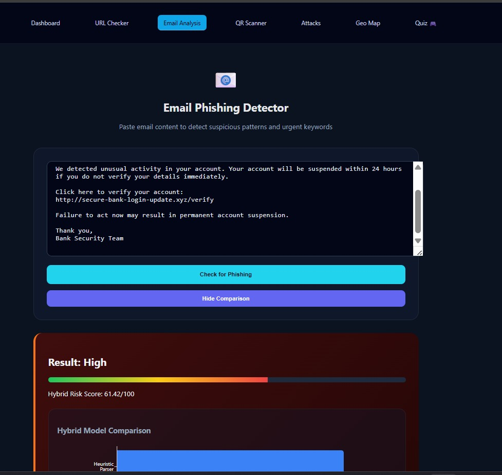
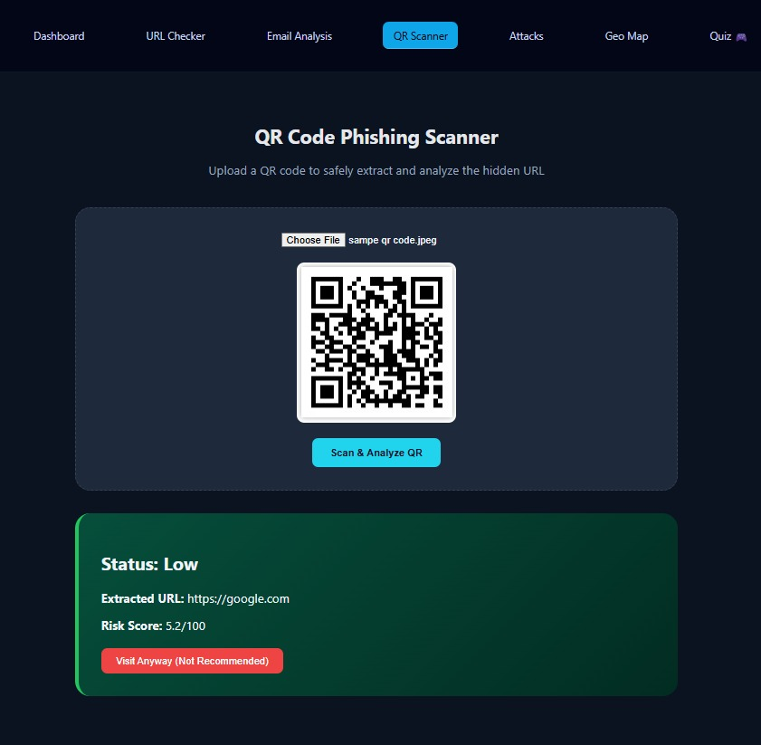

# PhishViz – AI-Powered Phishing Detection & Analysis

PhishViz is an advanced, AI-driven cybersecurity platform designed to detect, analyze, and visualize phishing threats in real-time. It leverages Deep Learning, Machine Learning, and Interactive Dashboards to provide a comprehensive defense against modern cyber attacks.

## 🚀 New Features & Enhancements

- **🤖 CyberPhish AI Chatbot:** An integrated AI assistant to answer cybersecurity queries, analyze suspicious URLs, and provide safety tips.
- **📧 Email Phishing Analyzer:** Uses **LSTM (Long Short-Term Memory)** neural networks to scan email content for phishing indicators and social engineering tactics.
- **📷 QR Code Scanner:** Detects malicious URLs embedded in QR codes to prevent "Quishing" attacks.
- **🧠 Advanced Neural Networks:**
  - **ANN (Artificial Neural Network):** High-precision URL risk classification based on structural features.
  - **LSTM:** Sequential analysis for sophisticated text-based phishing detection.
- **🔍 SHAP-Explained URL Checker:** Provides transparency by explaining *why* a URL was flagged as risky using SHAP values.
- **🌐 Browser Extension:** A lightweight tool for real-time safety checks while browsing.
- **📊 Real-Time Live Alerts:** Instant notifications for detected threats using WebSockets (Socket.IO).
- **🗺️ Interactive Geo-Map:** Visualizes the geographic origin and concentration of phishing attacks globally.

## 🧠 AI / ML Model Architecture

- **LSTM (Deep Learning):** Sequence-based detection for emails and text.
- **ANN (Deep Learning):** Feature-heavy URL classification.
- **Random Forest:** Ensemble learning for high-accuracy threat categorization.
- **Logistic Regression:** Robust baseline for URL safety scoring.
- **K-Means Clustering:** Geographic risk segmentation.
- **SHAP (Explainable AI):** Interpretable model results to build user trust.

## 🛠 Tech Stack

- **Frontend:** React.js, Vite, Recharts, React Simple Maps, Axios.
- **Backend:** Python, Flask, Flask-SocketIO, Eventlet.
- **Machine Learning:** TensorFlow, Keras, scikit-learn, joblib, SHAP.
- **Data Handling:** Pandas, NumPy.
- **Styles:** Vanilla CSS (Modern Aesthetics).

## 📸 Screenshots

<div align="center">
  <h3>Main Dashboard</h3>
  
  
  <h3>Email Analyzer (AI Scanner)</h3>
  
  
  <h3>QR Code Scanner</h3>
  
  
  <h3>URL Risk Analysis (SHAP Explained)</h3>
  
  
  <h3>Geographic Threat Map</h3>
  
  
  <h3>Attack Analysis Trends</h3>
  
</div>

## ⚙️ How to Run Locally

### 1. Prerequisites
- Python 3.8+
- Node.js & npm

### 2. Backend Setup
```bash
cd backend
python -m venv venv
source venv/bin/activate  # On Windows: .\venv\Scripts\activate
pip install -r requirements.txt
python app.py
```
*The backend will run on `http://localhost:5001`.*

### 3. Frontend Setup
```bash
cd client
npm install
npm run dev
```
*The frontend will run on `http://localhost:5173`.*

### 4. Browser Extension (Optional)
- Open Chrome -> `chrome://extensions/`
- Enable "Developer mode"
- Click "Load unpacked" and select the `extension` folder.

---

**Developed by Shaziya Shaikh**
