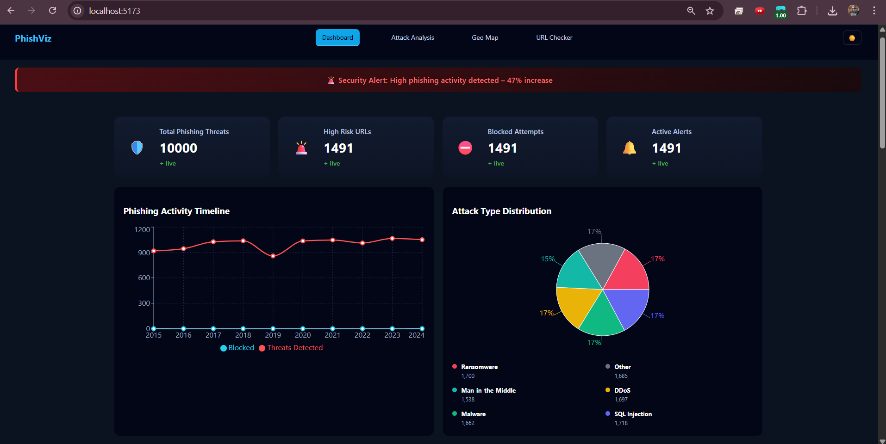
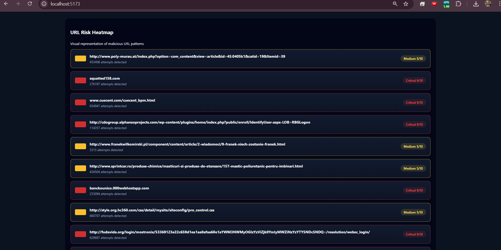
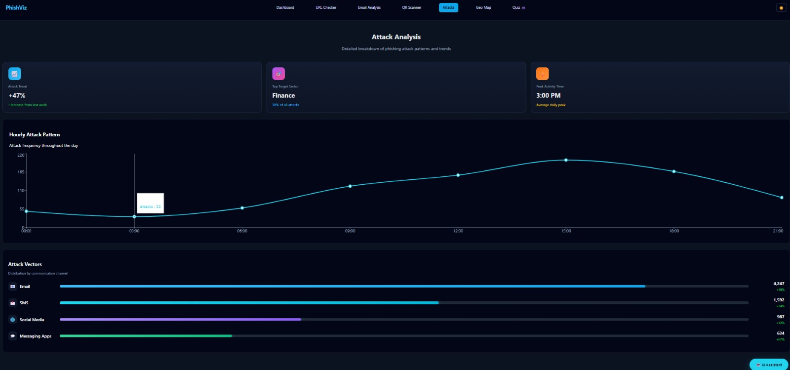
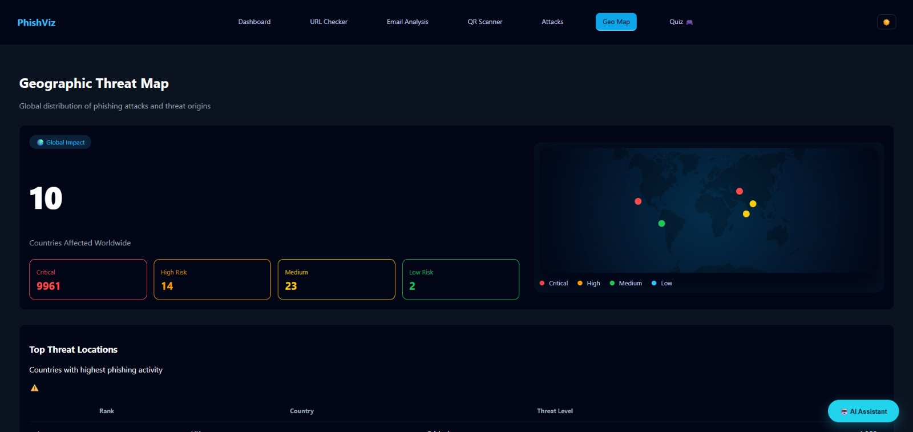
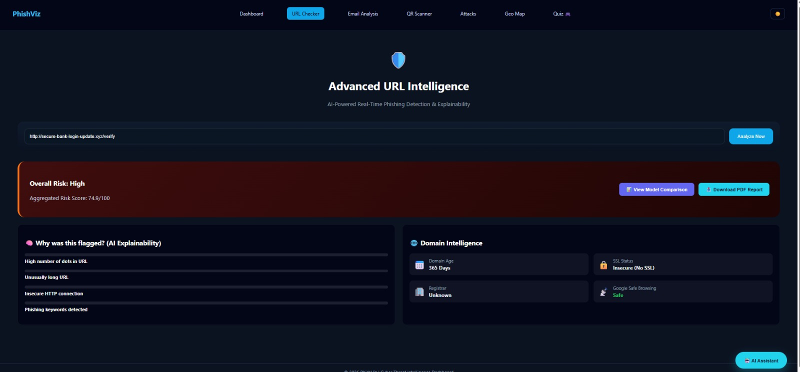
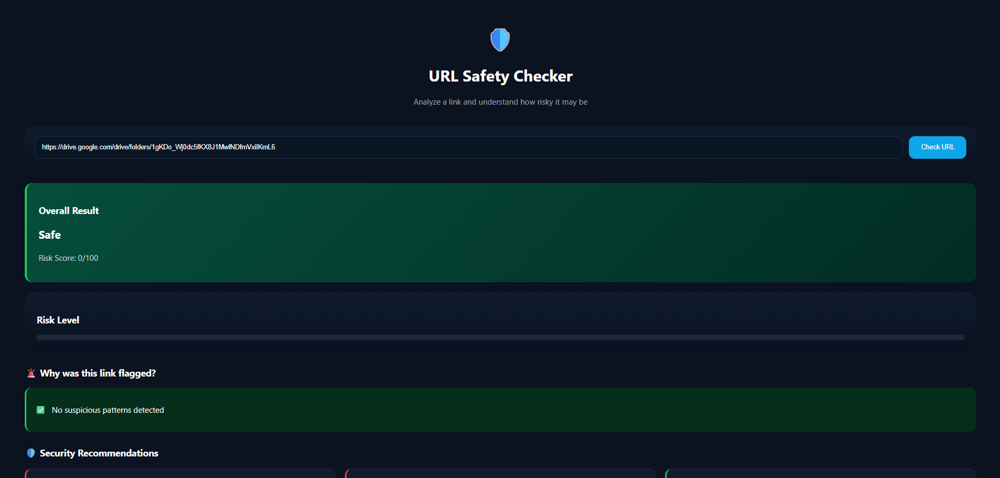

# PhishViz – Phishing Threat Analysis (AI / ML)

PhishViz is an AI-enabled cybersecurity project that analyzes and visualizes phishing threats using interactive dashboards.  
Machine Learning is used to classify risky URLs, detect attack patterns, and support visual insights.

## 🔹 Key Features
- Phishing threat dashboard
- Attack trend analysis
- Geographic threat visualization
- URL safety checker
- ML-based risk prediction & clustering

## 🧠 AI / ML Used
- Logistic Regression – URL risk classification  
- K-Means – Country risk clustering  
- Random Forest – Attack type prediction  

## 🛠 Tech Stack
React.js • Python • scikit-learn • pandas • Data Visualization

## 📸 Screenshots

  
  
  
  
  
  

---

**Developed by Sajiya Shaikh**